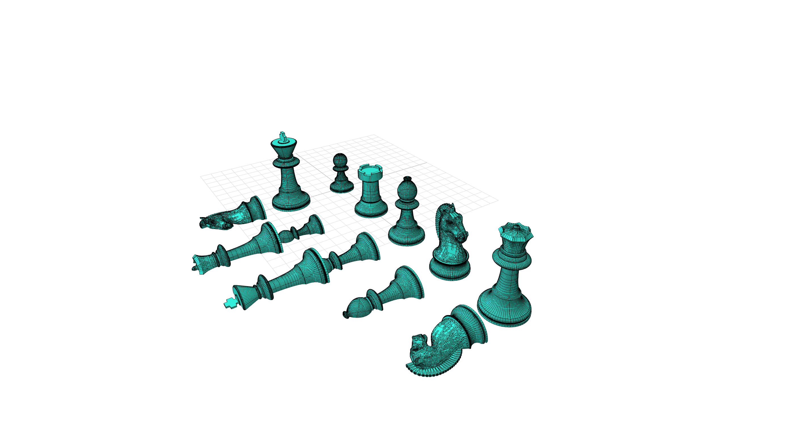

# manifold-chess-test



A code-based 3D model.

> 🔧 This is a [CADit](https://cadit.app) script package - a code-based 3D model you can open and modify.
> 
> Open this design in [CADit](https://cadit.app) to preview in 3D, customize, and export.
> You can also fork this design and re-publish your own version!

## Use in Your Project

Install as a dependency in your TypeScript/JavaScript project:

```bash
npm install @cadit-app/manifold-chess-test
```

Then import and use it in your code.

## Build Locally

Clone this repo and build 3D files offline:

```bash
git clone https://github.com/CADit-app/manifold-chess-test.git
cd manifold-chess-test
npm install
npm run build:3mf
npm run build:glb
```

## License

[MIT License](https://opensource.org/licenses/MIT)

---

<p align="center">
  <sub>Created with <a href="https://cadit.app">CADit</a> - The open platform for code-based 3D models.</sub>
</p>
<p align="center">
  <sub>Use our web-based <a href="https://app.cadit.app">CAD application</a> to create, open and edit designs visually.</sub>
</p>
